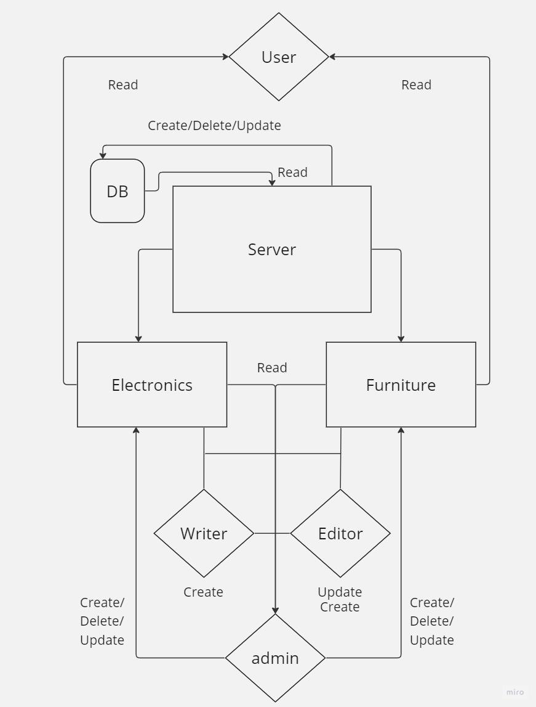

# Api-Auth-Furniture 
[](https://opensource.org/licenses/MIT)
## [PR](https://github.com/Haznto/Api-Auth-Furniture/pulls?q=is%3Apr+is%3Aclosed)
## [Actions](https://github.com/Haznto/Api-Auth-Furniture/actions)
## [Deployed link ](https://furniture-kpzu.onrender.com)
## Description 
Site that provides access to elctroinics and furniture for a front end project it cant be accessed without authentication.
 ## Main Features:

    1. Authentication: Implement user authentication to secure user accounts and restrict access to certain functionalities.

    2. API Support: Develop an API to support the required data for the site's functionality.

   

    3. RBAC (Role-Based Access Control): Implement RBAC to differentiate between admin and regular users. Admins can manage the site and users have read access, as well as the ability to create orders.

    4. Home Page: Create a homepage greets you .

# UML Layout

## Additional Features:

    1. Product Search: Allow users to search for specific room accessories based on id
    2. delete products 
    3. create products
    4. get all products
    5. create accounts
# file sturcture
  
  ```
LICENSE
├── README.md
├── __test__
│   └── server.test.js
├── coverage
│   ├── clover.xml
│   ├── coverage-final.json
│   ├── lcov-report
│   │   ├── base.css
│   │   ├── block-navigation.js
│   │   ├── favicon.png
│   │   ├── index.html
│   │   ├── prettify.css
│   │   ├── prettify.js
│   │   ├── sort-arrow-sprite.png
│   │   └── sorter.js
│   └── lcov.info
├── index.js
├── memory
├── package-lock.json
├── package.json
└── src
    ├── error-handlers
    │   ├── 404.js
    │   └── 500.js
    ├── middleware
    │   ├── acl.js
    │   ├── basic.js
    │   ├── bearer.js
    │   ├── logger.js
    │   └── modelParam.js
    ├── models
    │   ├── data-collection.js
    │   └── index.js
    ├── routes
    │   ├── auth.js
    │   └── modelRoute.js
    └── server.js 
 ```
 ## Installation Instructions
Installation:

    Make sure you have Node.js and npm (Node Package Manager) installed on your system.
    Clone the repository from GitHub to your local machine.
    Open a terminal and navigate to the project's root directory.
    Run the command npm install to install the dependencies required for the application.

Testing:

    To run the tests for the application, use the command npm test.
    The tests will be executed, and the results will be displayed in the terminal.
    Ensure that all tests pass successfully before proceeding.

Running the Application:

    To run the application, use the command nodemon in the terminal.
    The application will start, and you should see a message indicating that it's running.
    You can access the application by opening a web browser and navigating to the appropriate URL (e.g., http://localhost:3000).
## How to use 


- **post /signup**: signing up. [signin](https://furniture-kpzu.onrender.com/signup)


### login Resource

- **post /signin**: sign in records. [singup](https://furniture-kpzu.onrender.com/singin)


### secret Resource

- **get /**: Retrieve a secret [secret](https://furniture-kpzu.onrender.com/secret)
 

## Usage Guide 
you go to **localhost:3000/furniture/the desired model**
you can add stuff using the body cause i used body parser regarding the food you shoud write it like that 
### signup endpoint it should be in the body
```json
{
  "username": "rice",
  "password": "123",
  "role": "admin"
}
```
### login should be in the header so basic authentication 
```json
{
  "username": "rice",
  "password": "123",
  "role": "admin"
}

```
### /furniture/:model endpoint it should be in the body
```json
{
  "name": "rice",
  "brand": "123",
  "type": "dta"

}
